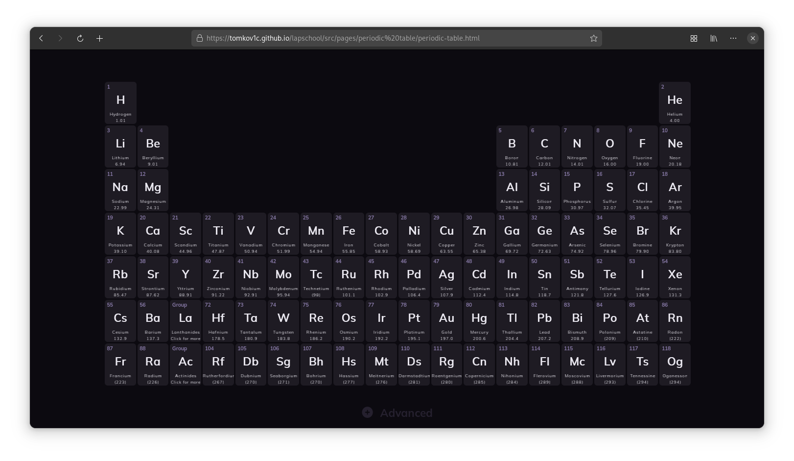

# Lapschool
So in my 3rd year of highschool, I constantly had to carry
                        some paper database diagrams to my class. I used a laptop to take notes and after sometime it
                        became annoying to carry that one specific piece of paper around, so it thought "Why not just
                        digitize it?", so I did. It accrued to me that other students may have the same problem.
                         
                        This is the result. Lapschool is just a place where you can find a lot of diagrams,tools and more 
                        digitalized and interactive on a computer so you wont have to carry anything with you to classes,
                        just your laptop.

## The Periodic Table
This is currently the only ported "tool". It has everything that a regular paper periodic table would have but I added a new feature. You can click on the element and the site will display some additional information about that element. I am not a chemist and all data is sourced from Wikipedia, so please report any mistakes you find.

 

